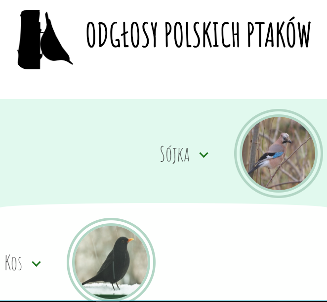

# polish-birds-sounds
Click on a bird image to hear its sound, click on its name to read more. An excercise to practice flex-box grid, RWD, jQuery and Sass logics.  

As long as image name and the corresponding sound file name are the same, new birds may be added at will thanks to a $each loop.

